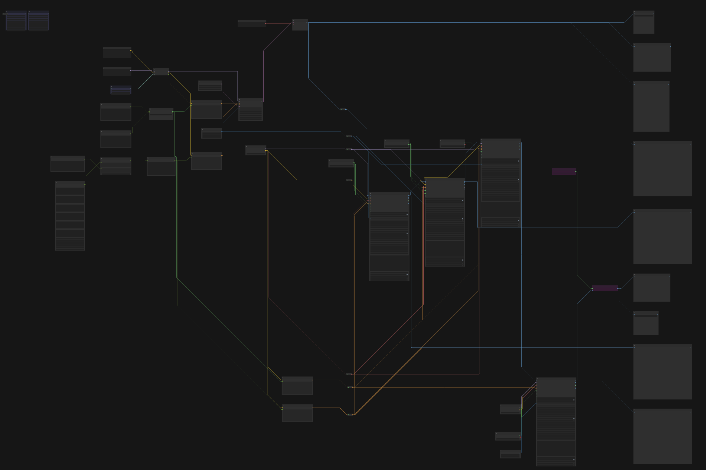
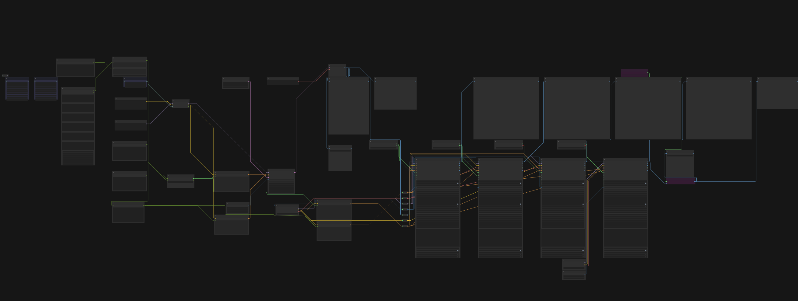

# Easy Workflow Layout

A ComfyUI extension that organizes workflow nodes into a clean, flowchart-like layout. Same-type nodes are aligned, connected nodes flow left-to-right, and overlaps are eliminated.

## Installation

| Method | Command |
|--------|---------|
| **ComfyUI Manager** | Search for "Easy Workflow Layout" in the Manager |
| **Comfy Registry**  | `comfy node install easy-workflow-layout` |
| **Manual**          | `git clone https://github.com/aeslampanah/ComfyUI-Easy-Workflow-Layout.git` |

No additional Python dependencies required.

## Usage

1. Finalize your workflow. Reroute nodes are handled automatically — they are grouped into a compact column.
2. Trigger the layout using either method:
   - **Right-click** the canvas → **Easy Workflow Layout**
   - **Top menu bar** → **Extensions > Easy Workflow Layout > Easy Workflow Layout**
3. Adjust column and node spacing via **ComfyUI Settings**.

## Algorithm

The layout engine combines ELK (Eclipse Layout Kernel) with custom post-processing to produce overlap-free, hand-organized-quality results.

1. **ELK Layered Layout** — Assigns each node a pipeline stage (column). ELK's default X placement already pulls inputs close to their consumers.
2. **Sink Re-anchoring** — Terminal nodes (e.g., `PreviewImage`) are placed immediately after their producer rather than being dumped in the last column.
3. **Same-Type Lanes** — Nodes of the same type that share a column (e.g., multiple `FaceDetailer` or `UltralyticsDetectorProvider` instances) are snapped to a shared horizontal lane.
4. **Overlap-Free Placement** — Remaining nodes are positioned near their connected neighbors, then shifted vertically until no overlaps exist.
5. **Reroute Collation** — Reroute nodes are gathered into a single compact column at their fan-out point.
6. **Column Consolidation** — Nodes with a single predecessor in the adjacent column are merged into that column, eliminating unnecessary stages.

**Configuration** — Two settings control layout density:

| Setting   | Description                             |
|-----------|-----------------------------------------|
| `ranksep` | Horizontal spacing between columns      |
| `nodesep` | Vertical spacing between nodes          |

**Requirements**: ComfyUI ≥ 0.12.3

## TODO

- [ ] Apply layout to a subset of nodes instead of the full graph

## Example

Before (auto-arranged):

After (Easy Workflow Layout):

